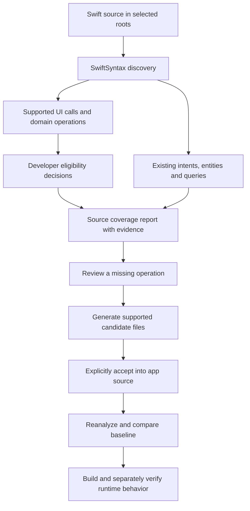

# IntentCoverage

**Find the gap between what users can do in your SwiftUI app and what its App Intents expose.**

IntentCoverage is a local Swift command-line tool that discovers a supported subset of user-facing operations, maps existing App Intents to those operations, and shows the source evidence behind each finding. It also generates a reviewed Search adapter for the included TaskFlow demo and checks for regressions against a saved report.

**Status: 0.1.0 preview.** The initial product is a controlled, reproducible workflow. Source analysis, candidate generation, and regression checks work today. Generation currently supports TaskFlow Search only. System execution through the generated iOS 27 AppIntentsTesting tests remains unverified.

[Quick start](#quick-start) · [Detailed usage guide](docs/usage.md) · [CLI reference](#cli-reference) · [Limitations](#what-it-does-and-does-not-prove) · [Contributing](CONTRIBUTING.md)

## The problem it solves

An app can let users create, complete, search, delete, and reschedule tasks in its UI while exposing only Create and Complete as App Intents. A team reviewing its intent declarations might see two working adapters without noticing the three missing operations.

Counting intent types alone does not answer the useful questions:

- Which user-facing operations have an intent that calls the same domain code?
- Which operations are missing exposure, and where is their implementation?
- Is an operation appropriate to expose, or does it require a policy decision?
- Did a refactor remove or rename an existing mapped intent?
- Does a percentage describe source declarations, or behavior that actually ran?

IntentCoverage makes those questions reviewable. It connects supported UI call sites to domain methods and intent implementations, records file/line evidence, and keeps developer eligibility decisions separate from discovery. A saved baseline can catch lost mappings even when the overall percentage does not change.

A finding is a starting point for engineering review. The tool does not decide that every app action should be available outside the app, or prove that Siri and Shortcuts work.

## Who it is for

- Swift developers auditing small SwiftUI projects that use explicit calls into reusable domain services.
- App Intents maintainers checking whether adapters continue to expose the intended operations after refactors.
- Teams evaluating a repeatable source-review step before adding their own runtime and physical-device tests.
- Contributors exploring a SwiftSyntax-based approach to explainable capability discovery.

Start with the included demo to understand the supported patterns. Projects built around injected instance receivers, UIKit-only screens, macros, or complex call graphs will need broader analysis than this preview provides.

## What the demo shows

TaskFlow is a small, persistent SwiftUI task app. Its five UI operations share an actor-isolated repository. Initially, only Create and Complete have App Intent adapters.

| Capability | Initial source exposure | After accepting generated Search |
| --- | --- | --- |
| Create Task | `CreateTaskIntent` | Unchanged |
| Complete Task | `CompleteTaskIntent` | Unchanged |
| Search Tasks | Missing | `SearchTasksIntent` |
| Delete Task | Missing | Missing |
| Change Due Date | Missing | Missing |
| **Eligible operations with mapped intents** | **2/5 — 40%** | **3/5 — 60%** |

The demo's eligibility configuration records a reason for each operation. Deletion is eligible in that fixture only with explicit confirmation; the tool does not generate a deletion intent or implement that confirmation policy for you.

Selected output from the initial report:

```text
IntentCoverage · TaskFlowDemo

App Intent source coverage: 40% (2/5)
Basis: reviewed_source_mapping
Unreviewed candidates: 0

○ Change Due Date  [MISSING]
✓ Complete Task  [EXPOSED]  CompleteTaskIntent
✓ Create Task  [EXPOSED]  CreateTaskIntent
○ Delete Task  [MISSING]
○ Search Tasks  [MISSING]

Runtime validation: not_run
Siri experience: not_checked
```

Generating candidate files alone leaves the score at **40%**. It changes to **60%** after the Search intent is explicitly accepted into the scanned app source. The resulting app still needs compilation and runtime validation.

## Quick start

### Requirements

- macOS with a Swift 6.3-compatible toolchain. The tested baseline is **Xcode 26.6 / Swift 6.3.3**.
- Git and **Python 3.10+** for the demo and repository scripts.
- Internet access for the initial Swift Package Manager dependency download. SwiftSyntax **603.0.2** is pinned.
- Repository access while this project is private. There is no published binary or Homebrew package yet.

A phone, signing certificate, API key, and backend are not required for source analysis. Full Xcode is required for the demo's optional iOS build. Analysis itself makes no network requests.

### 1. Clone and build

```sh
git clone git@github.com:saksham2599/IntentCoverage.git
cd IntentCoverage
swift build --jobs 2
export PATH="$PWD/.build/debug:$PATH"
intentcoverage --version
```

The `PATH` change applies to the current shell. You can also invoke `.build/debug/intentcoverage` directly from the repository root.

### 2. Analyze and investigate a gap

```sh
intentcoverage analyze Examples/TaskFlowDemo
intentcoverage explain search_tasks Examples/TaskFlowDemo
```

The first command reports five eligible capabilities and two exposed ones. The second explains the Search finding and points to the actual domain declaration and UI call site. Follow those locations when reviewing whether the mapping is correct.

### 3. Run the complete source workflow

```sh
python3 scripts/demo.py --build
```

This command creates a new disposable copy under `.intentcoverage/` and:

1. Confirms the initial 2/5 exposure.
2. Generates Search candidate code and separate integration-test source.
3. Confirms that candidates alone leave exposure unchanged.
4. Explicitly accepts Search into the disposable app copy and confirms 3/5.
5. Checks that removing Search fails the baseline gate.
6. Checks that renaming Search also fails, even though the percentage stays at 60%.
7. Compiles the accepted app for generic physical iOS without signing.

The example under `Examples/TaskFlowDemo` stays at two intents. The script prints the artifact directory; `.intentcoverage/latest-demo.txt` records the last successful run. Each run uses a new directory.

Omit `--build` for the source-only workflow. If your binary uses a custom build location, pass `--binary /path/to/intentcoverage`. Neither variant executes the generated AppIntentsTesting tests.

For a hands-on walkthrough of generation and acceptance, follow [the usage guide](docs/usage.md).

## How it works



The scanner currently recognizes explicit calls such as `TaskRepository.shared.searchTasks(query:)` or `Type.method(...)` inside SwiftUI `View`/`App` declarations. It matches an unambiguous method declaration from a small operation-verb vocabulary and looks for existing discoverable intent implementations calling that same symbol.

It inventories local intent conformances, `@Parameter` names, entities, query types, and shortcut providers. An entity query that searches records does not by itself count as a standalone Search App Intent. Comments and string literals do not create intent declarations.

Generation reuses the demo's domain layer. The reviewed binding pins the domain and entity source digests so an adapter is not silently generated against a changed contract. See [generation contracts](docs/generation.md).

## Understanding the score

```text
Source coverage = eligible discovered capabilities with mapped intents
                  -------------------------------------------------- × 100
                          eligible discovered capabilities
```

The denominator is **supported, discovered, eligible capabilities**, not every feature in the app. A high score can coexist with undiscovered features outside the scanner's supported syntax.

| Report concept | Meaning |
| --- | --- |
| `eligible` | Included in the source-coverage denominator. |
| `excluded` | Deliberately omitted by a recorded decision. |
| `needs_review` | Eligibility is unresolved; omitted from the denominator. |
| `reviewState: unreviewed` | No explicit decision is recorded for that discovered capability. |
| `provisional_source_mapping` | At least one discovery has no recorded decision. |
| `reviewed_source_mapping` | Every discovered capability has a recorded decision; this is not runtime proof. |
| `runtimeValidation: not_run` | Report v1 does not ingest system test results. |
| `siriExperience: not_checked` | Speech and Siri behavior have not been established by analysis. |

Ordinary read/write discoveries are provisionally eligible. Unreviewed destructive discoveries default to `needs_review`. With no eligible capabilities, the percentage is **N/A**, not 100%.

The terminal's `MISSING`/`EXPOSED` labels summarize mappings. Inspect the JSON eligibility and review fields when making policy decisions. Configuration records decisions; it cannot manufacture capabilities the scanner did not find.

## CLI reference

Commands below use the `intentcoverage` executable added to `PATH` in Quick start. `<project>` is a directory, not an `.xcodeproj` file.

| Command | Purpose |
| --- | --- |
| `analyze <project>` | Print source coverage, mappings, and diagnostics. |
| `analyze <project> --json` | Print the complete JSON report. |
| `analyze <project> --output <report.json>` | Save a report while still printing the human-readable summary. |
| `explain <capability> <project>` | Show the decision, domain symbol, source locations, and mapped intents. |
| `generate <capability> <project> --output <new-directory>` | Generate supported candidate files into a new directory. |
| `check <project> --baseline <report.json>` | Compare current source mappings with a reviewed baseline. |
| `doctor` | Inspect local Xcode framework presence; it does not validate a connected phone. |
| `--help` / `--version` | Show usage or tool version. |

`analyze` accepts `--json` and `--output` together. See [configuration, baseline gates, exit codes, and troubleshooting](docs/usage.md).

## What it does and does not prove

| Evidence | Current status and boundary |
| --- | --- |
| Source discovery and coverage workflow | Implemented and tested for the supported subset, including the TaskFlow 40% → 60% transition. |
| Candidate generation | Implemented for the reviewed `taskflow-search-v1` adapter only. |
| App compilation | The accepted generated adapter compiles for physical iOS. CI reproduces this unsigned build. |
| Ordinary physical UI behavior | The recorded iPhone 12 test passed all five TaskFlow operations and persistence. This is separate from system intent execution. |
| AppIntentsTesting | Test source is generated, but compilation and execution on the required Xcode 27 / iOS 27 setup remain unverified. |
| Siri, Shortcuts, Spotlight, Apple Intelligence | Not validated by the source report or the ordinary UI test. |

This preview does not resolve injected instance receivers, full call graphs, macro expansion, build-condition configurations, UIKit navigation, Xcode target membership, external protocol conformances, or dynamic dispatch comprehensively. Ambiguity and unsupported patterns can reduce discovery. Malformed Swift, invalid roots, and capability ID collisions fail analysis rather than silently produce a partial score.

There is no AI model, provider integration, automatic arbitrary-app rewrite, runtime-result ingestion, or App Store submission workflow in the current implementation. Planned capabilities must not be treated as shipped features.

## Working with your own app

Start by selecting relevant source folders and running discovery before adding policy decisions. Review each finding and inspect gaps the syntax-based scanner may miss. Save a baseline only after that review. Generic analysis is available for the supported patterns; generation remains limited to TaskFlow Search.

The [usage guide](docs/usage.md) covers the configuration format, a supported Swift example, a safe manual demo, baseline review, and common errors.

For the TaskFlow UI, set a bundle identifier you control in `Examples/TaskFlowDemo/.intentcoverage-generation.json`, regenerate with your own signing team, and select your physical iPhone in Xcode. Follow [the device instructions](docs/usage.md#run-taskflow-on-a-physical-iphone). No simulator is used by this project.

## Privacy, validation, and contribution

Analysis reads local source; it does not upload it, send telemetry, or call an AI provider. Reports contain source symbols and relative file/line evidence, so review them before sharing material from a private app. Dependency downloads and GitHub CI are separate network operations. Candidate files require explicit acceptance.

The publishable preview's [first CI run passed](https://github.com/saksham2599/IntentCoverage/actions/runs/34696848542): 11 Swift tests, repository checks, source-regression checks, and generated-app compilation. Historical physical-device evidence and its limits are in the [verification record](docs/verification.md).

| Resource | What you will find |
| --- | --- |
| [Usage guide](docs/usage.md) | Configuration, manual walkthrough, CI usage and troubleshooting. |
| [Report schema](Schemas/report.schema.json) | Machine-readable report structure. |
| [Configuration schema](Schemas/config.schema.json) | Scope and eligibility decision structure. |
| [Generation contract](docs/generation.md) | Supported adapter and compatibility checks. |
| [Research](docs/phase-0-research.md) | Original feasibility research and architecture decisions. |
| [Contributing](CONTRIBUTING.md) | Development setup, checks, and review expectations. |
| [Security](SECURITY.md) | Private vulnerability reporting guidance. |
| [Community conduct](CODE_OF_CONDUCT.md) | Contributor expectations. |
| [Changelog](CHANGELOG.md) / [release checklist](docs/releasing.md) | Preview status and release preparation. |

Original code is [MIT licensed](LICENSE). Dependencies retain their own licenses; see [third-party notices](THIRD_PARTY_NOTICES.md).
