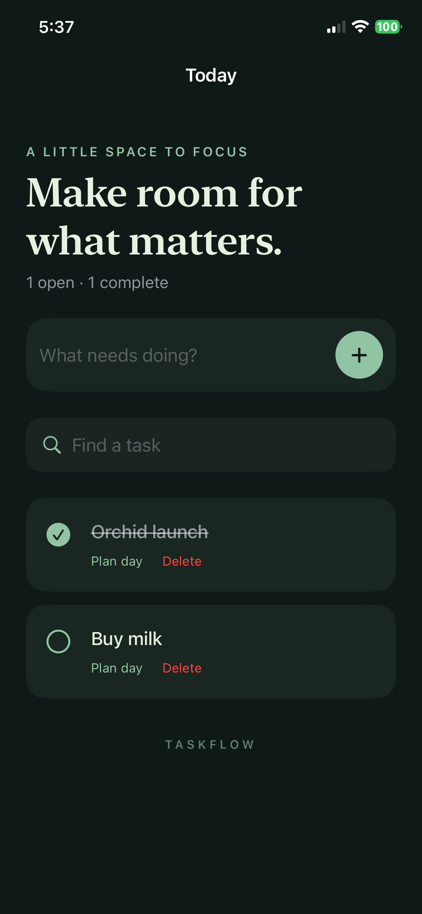

# Verification record

Date: September 12, 2026. Historical device evidence refers to local prototype revision `6b22268`, preserved in the maintainer’s local archive. Open-source preparation changes signing defaults and repository tooling; it does not constitute a new physical-device run.

## Confirmed

- **11 Swift Testing tests passed in two suites**, using SwiftSyntax 603.0.2. They cover domain behavior, corruption protection, concurrent writes, discovery without the decision manifest, hidden/conditional/protocol false positives, generation contract checks, and acceptance changing source exposure from 40% to 60%.
- Real CLI reports show 2/5 before generation, 2/5 with candidates only, and 3/5 after acceptance. Removing or renaming the accepted intent exits 2 in the baseline gate, including a rename that leaves the score unchanged.
- Baseline application and UI test targets compiled for physical iOS. Corrected targets also passed development-signed build-for-testing.
- The generated Search adapter accepted into the disposable TaskFlow copy **compiled successfully** for generic physical iOS (Xcode 26.6, iOS SDK 26.5, Debug arm64, unsigned).
- **Physical iPhone 12 UI retry passed: one workflow test, zero failures, 58.969 seconds**, on iOS 26.6.1 (23G83). No simulator selected or used.
- Normal TaskFlow launch was restored successfully after the test; the owned phone reservation was released.

## Physical workflow and visual review

The passing test created two tasks, checked persistence through relaunch, searched case-insensitively, completed a task, set and removed its due date, cleared search, cancelled deletion, confirmed deletion, and verified deletion plus the remaining task through another relaunch. It used a unique DEBUG test store, separate from normal data.

The screenshot was inspected: the corrected dark palette presents the title, cards, task states and actions clearly, and the keyboard no longer obscures the workflow. This visual inspection does not establish a full accessibility audit or light-mode/Dynamic Type pass.

The first physical run failed while tapping Cancel in a confirmation dialog and exposed poor dark-mode contrast. The app now uses an explicit deletion alert with captured task identity, adapts its palette to color scheme, and dismisses keyboard focus for task actions. The passing retry verifies those changes and supersedes that failed run.

## Evidence

- Saved CLI, unit-test, physical result and screenshot evidence: [implementation-evidence](../research/implementation-evidence/README.md).
- Original result bundles remain local to the maintainer; they are not included in the repository.
- Disposable accepted app and build log: `.intentcoverage/demo-20260912T113222270969Z/`.
- Full test/build logs remain under ignored `.intentcoverage/`; temporary paths can be removed by system cleanup. Retained text summaries and screenshot are committed.

## Not verified

- **AppIntentsTesting compilation/execution:** Xcode 27 and iOS 27 are required and unavailable in the active setup. Generated test source is prepared, uncompiled and unrun with that framework.
- Siri speech, Shortcuts execution, Spotlight behavior, and Apple Intelligence experiences.
- Generalized arbitrary-project analysis or generation.

Source report v1 always records runtime validation as `not_run`. A successful app build and ordinary UI test do not prove system App Intent execution. The required integration-test lane remains the next step when compatible tooling and the physical phone runtime are available.
